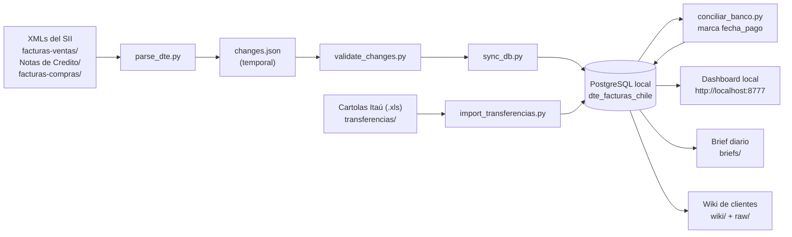
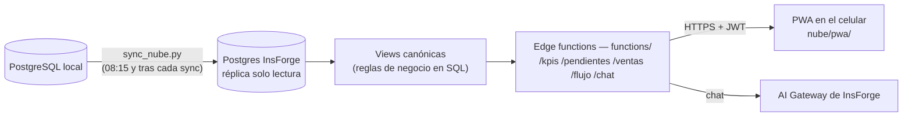

# Zigurat ERP — Agente Facturas

Sistema de gestión para **Zigurat Brewery** (Elaboradora y Comercializadora Vintage SPA).
Automatiza el ciclo completo del negocio: facturas electrónicas del SII → base de datos →
cobranza → flujo de caja → costos, con un dashboard local con agente IA y una app móvil
en la nube para consultar desde el celular.

> **Este README es el mapa de orientación** (qué es cada carpeta y cómo se conecta todo).
> La guía técnica detallada para trabajar con Claude Code está en
> [.claude/CLAUDE.md](.claude/CLAUDE.md) y [app/CLAUDE.md](app/CLAUDE.md).

---

## La vista general: un sistema de 4 pisos

| Piso | Qué es | Dónde vive | Tecnología |
|------|--------|------------|------------|
| **4 — Nube** | API + chat + app móvil para consultar desde el celular | InsForge (proyecto `zigurat-movil`) — código en `functions/` y `nube/` | Deno/TypeScript, React |
| **3 — Frontends** | Lo que ves en pantalla: dashboard local y PWA móvil | `app/dashboard_ui.html` (PC) y `nube/pwa/` (celular) | HTML+JS / React+Vite |
| **2 — Backend local** | El motor: procesa XMLs, concilia el banco, calcula costos y flujo | `scripts/` (procesos) + `app/` (servidor del dashboard y agente) | Python |
| **1 — Base de datos** | **La fuente de verdad** | PostgreSQL local `dte_facturas_chile`, puerto 5432. **No es una carpeta del proyecto**: es un servicio de Windows | PostgreSQL |

La regla de oro: **el Postgres local es la única fuente de verdad**. La nube es una
réplica de solo lectura que se refresca desde tu PC; si el PC está apagado, el celular
muestra los datos del último sync.

---

## Cómo fluye la información

### El ciclo local (el núcleo del sistema)



Los 3 pasos del pipeline DTE son secuenciales y obligatorios: `sync_db.py` se niega a
correr si `validate_changes.py` no dejó el flag `.changes_validated`.

### De tu PC al celular (la nube)



---

## Mapa de carpetas

### El sistema (código que hace el trabajo)

| Carpeta | Qué contiene |
|---------|--------------|
| `scripts/` | ~35 procesos Python que se ejecutan por lotes: pipeline DTE (`parse_dte`, `validate_changes`, `sync_db`), conciliación bancaria, flujo de caja, costos y recetas, wiki, brief diario, backup, réplica a la nube (`sync_nube.py`), migraciones de esquema (`migrate_*`, idempotentes) e instaladores de tareas programadas (`instalar_tarea_*.ps1`) |
| `app/` | El Centro de Comando: `dashboard.py` (servidor web local), `dashboard_ui.html` (la interfaz), `negocio/` (lógica de lectura y acciones), `agent/` (el agente IA del chat, Claude Agent SDK), `canvas/`, `charts/`, `briefing/` |
| `functions/` | Edge functions de la nube (Deno/TypeScript): `/kpis`, `/pendientes`, `/ventas`, `/flujo`, `/chat`. **Vive en la raíz porque el compilador de InsForge lo exige** — no moverla a `nube/` |
| `nube/pwa/` | La app móvil (React + TypeScript + Vite), instalable como PWA en el celular. `nube/dist/` y `nube/pwa/dist/` son builds generados (ignorados por git) |
| `tests/` | Suite pytest del proyecto (`python -m pytest -q`) |
| `.claude/` | Los 16 comandos `/skill` (sync-facturas, consultar-ventas, conciliar-banco…), reglas por área, hooks de protección. **Se versiona** — es parte del sistema |

### Bandejas de entrada (archivos que TÚ dejas para procesar)

| Carpeta / archivo | Qué va ahí |
|-------------------|------------|
| `facturas-ventas/` | XMLs DTE de ventas del SII (`DTE_DDMMYYYY`) |
| `facturas-compras/` | XMLs de facturas de proveedores |
| `Notas de Credito/` | XMLs de NC (tipo 61) |
| `transferencias/` | Cartolas `.xls` del Itaú (`ConsultaTransferencia.xlsx`) |
| `Pagos_Inv_Serv_Gas.xlsx` | Planilla manual histórica de seguimiento de pagos (se importa con `importar_pagos_excel.py`) |
| `contactos.csv` (opcional) | Correos/teléfonos de clientes para el dashboard; plantilla en `contactos.ejemplo.csv` |

### Salidas generadas (las escribe el sistema, no las edites a mano)

| Carpeta / archivo | Qué es |
|-------------------|--------|
| `briefs/` | Brief diario del negocio (tarea de las 08:00) |
| `wiki/` + `raw/` | Fichas markdown de clientes + snapshots JSON que las alimentan |
| `memoria-agente/` | Memoria de largo plazo del agente del chat (se versiona) |
| `logs/` | Logs de las tareas programadas (ignorado por git) |
| `changes.json` + `.changes_validated` | Temporales del pipeline DTE — **no editar** (un hook lo bloquea) |
| Backups de la BD | Van **fuera del proyecto**: `C:\Users\cdela\OneDrive\Backups\zigurat-db` |

### Configuración y documentación

| Elemento | Qué es |
|----------|--------|
| `.env` / `.env.example` | Credenciales: BD local + conexión a InsForge. El `.env` real nunca va a git |
| `.mcp.json` | Conexión MCP a Postgres para consultas ad-hoc (no se versiona: trae la clave) |
| `AGENTS.md` | Instrucciones de InsForge para agentes de código |
| `docs/` | Specs y planes de cada fase de desarrollo (`docs/superpowers/`) + informes |
| `requirements.txt`, `pytest.ini` | Dependencias Python y config de tests |
| `iniciar_dashboard.bat` / `generar_brief.bat` | Accesos de doble clic: abrir el dashboard / generar el brief |

### NO son parte del sistema (puedes ignorarlas)

| Carpeta | Qué es |
|---------|--------|
| `github-repository/` | Dos repos ajenos clonados como material de consulta (`agency-agents`, `claude-howto`). Ignorada por git; nada del código la usa |
| `.superpowers/` | Archivos de trabajo del framework de skills de desarrollo (briefs/reports de tareas). Ignorada por git |
| `.insforge/` | Llaves del CLI de InsForge (ignorada por git) |
| `__pycache__/`, `.pytest_cache/`, `*.pyc` | Caché regenerable de Python |

---

## La rutina automática (Programador de tareas de Windows)

| Hora | Tarea | Script |
|------|-------|--------|
| 08:00 | Brief diario del negocio → `briefs/` | `scripts/generar_brief.py` |
| 08:15 | Réplica de datos a la nube | `scripts/sync_nube.py` |
| 23:00 | Backup verificado de la BD → OneDrive | `scripts/backup_db.py` |

Los instaladores de estas tareas están en `scripts/instalar_tarea_*.ps1`.
Además, las skills `/sync-facturas`, `/sync-nc` y `/conciliar-banco` disparan
`sync_nube.py` al terminar (no fatal: sin internet, el pipeline local termina igual).

## Comandos de todos los días

```bash
# Dashboard local (o doble clic en iniciar_dashboard.bat)
python app/dashboard.py          # → http://localhost:8777

# En Claude Code: los flujos de negocio son skills
/monitoreo-facturas              # ¿hay XMLs sin procesar? procesarlos
/conciliar-banco                 # cruzar transferencias con facturas
/consultar-ventas                # preguntas de ventas en español
/flujo-caja                      # proyección 4 semanas

# Tests
python -m pytest -q
```
